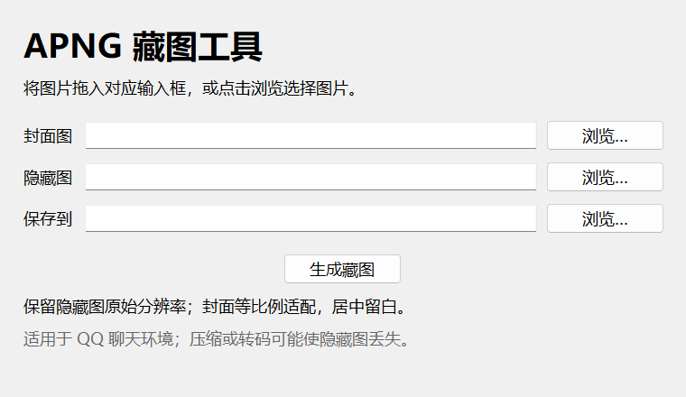
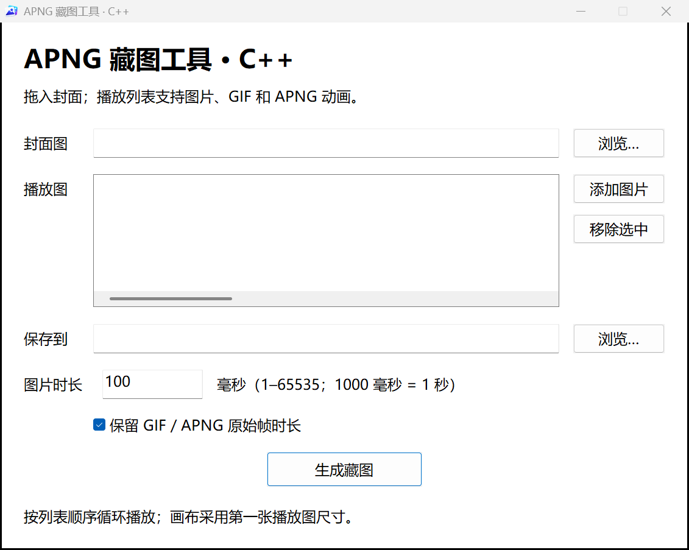

<p align="center">
  
</p>

<h1 align="center">QQ APNG 藏图工具</h1>

<p align="center">一张封面，一张隐藏图。拖入图片，生成适用于 QQ 聊天环境的 APNG。</p>

<p align="center">
  <a href="https://github.com/ryujou/qq-apng-disguise/releases/latest"></a>
  
  <a href="LICENSE"></a>
</p>

<p align="center"><a href="https://github.com/ryujou/qq-apng-disguise/releases/latest">下载 Windows EXE</a> · <a href="#使用方法">使用方法</a> · <a href="#运行源码">运行源码</a></p>



## 效果与适用环境

在 QQ 聊天中，缩略预览显示封面，查看原图时显示隐藏图片或播放多图动画。

**发送步骤很重要：先将生成的 PNG 发送到手机，再在手机 QQ 中选择该图片，勾选「原图」后发送，才有藏图效果。直接从电脑本地发送不能替代这个步骤。**

**Python 版生成的图片已由作者在手机 QQ 实测通过。** 电脑 QQ 从本地发送时会直接显示隐藏图，原参考样图也有相同行为；原消息或转发消息保留封面不代表本地发送也可用。C++ 版使用相同 APNG 结构，客户端效果需要单独实测。具体 QQ 版本组合尚未记录。

## 两种版本

| 版本 | 下载文件 | 实现 |
| --- | --- | --- |
| C++ 原生版 | `QQ-APNG-Disguise-CPP.exe` | C++17 / Win32 / Windows Imaging Component，无 Python、Qt 或额外运行库安装要求 |
| Python 版 | `QQ-APNG-Disguise.exe` | Python / Pillow / Tkinter，发行包已包含运行环境 |

C++ 版支持独立封面与多图循环播放，可批量拖入或选择播放图片，并移除选中项；保留路径规范化和防覆盖。图片按列表顺序播放，每张时长可设为 1–65535 ms（默认 100 ms），画布采用第一张播放图的尺寸，其他图片等比例适配并居中留白。每张画面使用完整帧加 1×1 同色小帧延时；单图保留至少两帧，总时长仍等于设定值。支持系统 WIC 可解码的 PNG、JPEG、BMP、GIF、TIFF；WebP 取决于系统是否安装对应编解码器。封面使用 WIC 等比例缩放；隐藏图保留解码后的分辨率和像素。两种版本的缩放算法和压缩结果不保证字节一致。



### 编译 C++ 原生版

使用 Windows x64 的 MinGW-w64 工具链（例如 [w64devkit](https://github.com/skeeto/w64devkit)）：

```powershell
./cpp/build.ps1 -Toolchain "C:\tools\w64devkit\bin"
```

源码为 `cpp/main.cpp`，图标沿用 `assets/icon.ico`。输出为 `dist/QQ-APNG-Disguise-CPP.exe`。编译及运行均不需要 Python。

也可以从命令行生成图片：

```powershell
./dist/QQ-APNG-Disguise-CPP.exe --delay-ms 1000 "封面.png" "播放图1.png" "播放图2.png" "播放图3.png" "结果.png"
```

## 功能

- 拖入封面图、隐藏图，也可通过文件选择器导入。
- 保留隐藏图原始分辨率；封面等比例缩放并居中留白。
- 支持中文与带空格路径，自动填写输出文件名。
- 本地处理，不联网、不上传图片；已有文件不会被覆盖。
- Windows 单文件 EXE，无需安装 Python；同时提供命令行入口。

## 使用方法

1. 从 [Releases](https://github.com/ryujou/qq-apng-disguise/releases/latest) 下载 `QQ-APNG-Disguise.exe`，双击运行。
2. C++ 版：拖入一张封面，将多张图片拖入「播放图」列表，或点击「添加图片」批量选择；按列表顺序播放，可用「移除选中」删除一项。Python 版：分别选择一张封面图和一张隐藏图。
3. 选择保存位置；C++ 版可填写「每张时长」，单位为毫秒，例如 1000 表示每张播放 1 秒。点击「生成藏图」。
4. 先将生成的 PNG 发送到手机，保留完整的原始文件。
5. 在手机 QQ 中选择该图片，**勾选「原图」后发送**，才有藏图效果。
6. 在聊天中检查封面预览，再打开原图确认隐藏图片或多图动画。

不要用截图或转存 JPG 替代生成的 PNG，这会丢失动画数据。拖入图片是从本地选择文件，不会上传至服务器。

## 运行源码

Windows 上使用 Python 3.11（已验证环境）：

```powershell
git clone https://github.com/ryujou/qq-apng-disguise.git
cd qq-apng-disguise
python -m venv .venv
.\.venv\Scripts\Activate.ps1
python -m pip install -r requirements.txt
python apng_disguise.py
```

命令行生成：

```powershell
python apng_disguise.py "封面.png" "隐藏图.png" "结果.png"
```

输入动画图片时读取其默认画面。输出路径必须使用 `.png`，且文件尚不存在。

## 打包 EXE

在 Windows PowerShell 7 中运行：

```powershell
python -m pip install -r requirements-build.txt
./build.ps1
```

产物位于 `dist/QQ-APNG-Disguise.exe`，包含多尺寸图标和拖拽组件。

## 工作原理

输出是一个带独立静态封面的 APNG 文件。C++ 版按每张图所设时长拆帧：先显示完整画面，后续每次只重写左上角的同色 1×1 像素，保留其余画面。每帧最长 100 ms，最后一帧使用剩余时长。

例如，500 ms = 完整帧 100 ms + 四个同色小帧各 100 ms；250 ms = 100 + 100 + 50 ms。单图且时长不超过 100 ms 时，将总时长均分给完整帧和小帧，保持至少两帧。全部动画帧使用保留画布、替换局部像素的方式（dispose=0、blend=0）。封面不参与循环。

文件同时写入 `ChatBarApngDisguise` 制作标记；该标记不代表 QQ 的兼容性保证。

Python 版仍采用以下单图结构：

| 内容 | 用途 |
| --- | --- |
| 默认静态图（IDAT） | 显示封面，不参与动画 |
| 动画第 1 帧 | 完整隐藏图，持续 100 ms |
| 动画第 2 帧 | 透明 1×1 占位帧，持续 100 ms，叠加后保持隐藏图 |

动画无限循环。静态解码器和动画解码器读取不同内容，从而产生预览与原图不同的效果。它不加密图片，隐藏图可被支持 APNG 的工具读取。

## 许可

项目采用 [MIT License](LICENSE)。第三方运行时与依赖保留各自许可证，随发行版提供。项目为独立工具，与 QQ 官方无关联。
